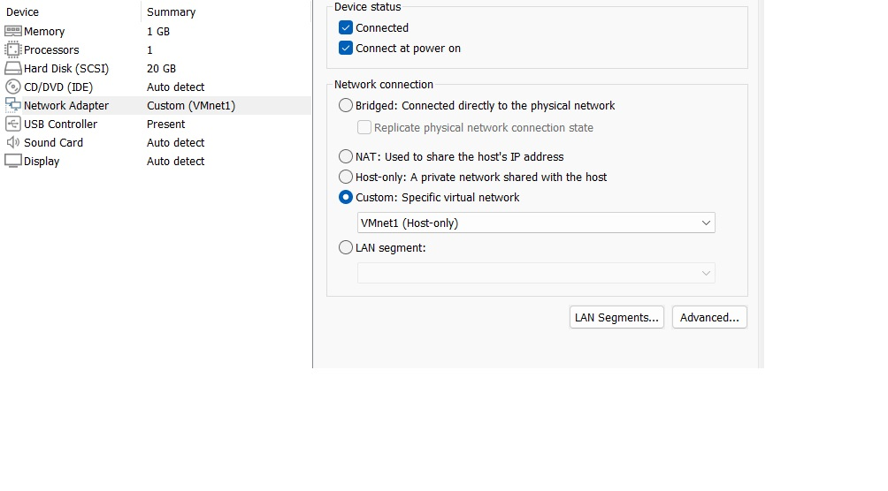

# Cấu hình DNS trên CentOS với Autoscript    

## Trước khi dùng lệnh yum để cài gói bất ki cần chỉnh


## Cài đặt và cấu hình

### Mở terminal, chuyển sang root user bằng lệnh:    
`su root` và nhập mật khẩu đã tạo tương ứng cho root    

### Sửa lỗi nguồn download của centos và cài đặt samba bằng lệnh:        
```
sed -i -e "/^mirrorlist/d;/^#baseurl=/{s,^#,,;s,/mirror,/vault,;}" /etc/yum.repos.d/CentOS*.repo    

yum install samba -y
```
### Tạo file samba và lưu đoạn code vào file:   
```
sudo nano ./samba.sh
```
### Sau khi tải về ta cấp quyền thực thi cho script bằng lệnh:
```
chmod +x ./samba.sh
```

## Thực thi    
### Để thuận tiện cho việc cấu hình trên VMWare ta cấu hình mạng lại như sau:

### Chạy file và cấu hình theo prompt.
```
sudo ./samba.sh
